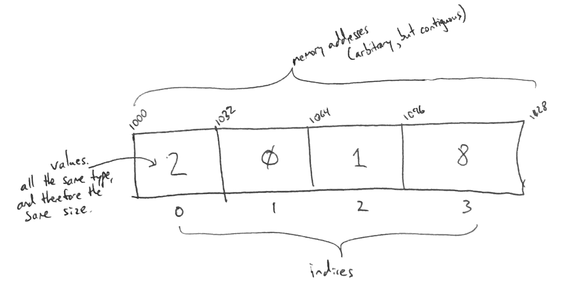

# Array

An array is simply an ordered data structure

# In Memory

In memory, an array looks like this:



Here you can see that an array has a base address, values that can be stored and an places that are prepared to take in values.

# Operations

An array supports the following operations:

* **retrieval/access/read**: obtain a value stored in the structure at a specific indexed position in the array.
  * O(1), constant time. An array variable really just records the base address of the array, so we know the exact memory address of the beginning of the array. We also know the data type of the elements in the array, and therefore the size of each element. Given the index of an element we wish to read, we can calculate the address of that element in *one step*: base address + sizeof(datatype) * index. Since we can calculate this in one step for all values in the array, this is an O(1) constant time operation.

* **search**: find a provided value inside the array and return it.
  * O(n), linear time. The reason for this being O(n) is that as opposed to knowing the exact position of an item or providing an index in the array to search, we must search through each index in the array. Until the provided item is found, it will have to continue to search, meaning the worst case would be that the item is at the last point inside the array.

* **insertion**: insert an item at a provided index
  * O(n), linear time. Using the base address and the provided position in which we want to stick the item, we can then navigate towards through the array and towards the correct position. What makes this operation O(n) is that we must shift every item after the position one place forward in order to allocate the space for the item that we are inserting.

* **deletion**: delete a provided value inside of the array
  * O(n), linear time. This operation takes advantage of searching in order to find a specified item. After the item is found, then it is simply removed, which means that if the item is in between two indexes, the items after must be shifted. This means that the operation will simply be O(n) since it must both search and shift in the array.
  
# Use Cases

An array is useful \[when\] \[why\].

It is not as good as \[what] \[why].

# Example

```
sample code showing creation, and exercising all of the operations
or
a program that doesn't use the structure, and then a version that does
```

(c) 2018 YOUR NAME. All rights reserved.
