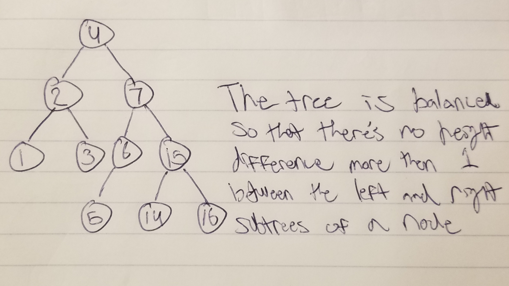

# AVL Tree

An AVL Tree is a tree that self balances, and therefore won't ever degrade into a linked list like a binary tree. This allows for all operations to be O(log(n)) all the time.

# In Memory

In memory, an AVL Tree looks like this:

# Operations

An AVL Tree supports the following operations:

* **Access**: ?
  * O(log(n)), logarithmic time.

* **Search**: Navigates through the tree, comparing the provided node we are searching for to the values of the children of the present node.
  * O(log(n)), logarithmic time.

* **Insertion**: Allows for the insertion of a node and the sorting and reorganization of the tree.
  * O(log(n)), logarithmic time.

* **Deletion**: Removes an item from the tree and then resorts the tree to abide by the rules of difference in height.
  * O(log(n)), logarithmic time.

# Use Cases

An AVL Tree is useful when you would like to store values in a tree without having to worry about the access or search operations becoming O(n).

An AVL Tree is not as good as a stack or queue when it comes to inserting or deleting items. Regardless of how efficient both O(1) and O(log(n)) are, insertion and deletion from a stack and queue are both best at O(1).

# Examples

~~~
AVL = b_BST()
AVL.insert(43)
AVL.remove(43)
~~~

[PREV PAGE](bst.md)

[NEXT PAGE](graph.md)

(c) 2018 Michael Fagan. All rights reserved.
