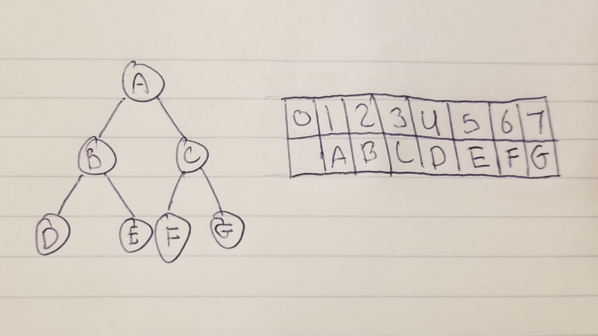

# Binary Heap

A Binary Heap is a structure that allows for many data types to be stored. This structure also doesn't allow duplicate items.

# In Memory

In memory, a binary heap looks like this:

# Operations

A Binary Heap supports the following operations:

* **Search**:
  * O(n), linear time. 

* **Insertion**:
  * O(n), linear time. 

* **Deletion**:
  * O(n), linear time. 

# Use Cases

A Binary Heap is useful when 

A Binary Heap is not as good as
# Examples

* **creation**:

~~~
BH = BinaryHeap()
~~~

* **search**:

~~~
BH.findMin()
~~~

~~~
BH.findMax()
~~~

* **insert**:

~~~
BH.insert(69)
~~~

* **delete**:

~~~
BH.delMin()
~~~

~~~
BH.delMax()
~~~

[PREV PAGE](graph.md)

[NEXT PAGE](queue.md)

(c) 2018 Michael Fagan. All rights reserved.
