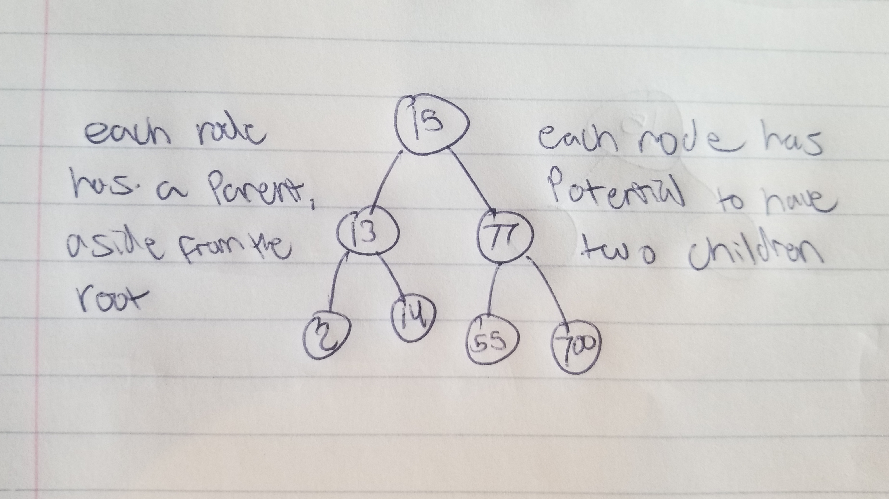

# Binary Search Tree

A Binary Search Tree is a structure that allows for quick and easy traversal, removal and addition because of its sorted nature. Items can be stored as a key and then with an accompanied value.

# In Memory

In memory, a Binary Search Tree looks like this:

# Operations

A Binary Search Tree supports the following operations:

* **Access**: Uses a provided key to search for its relative node.
  * O(n), linear time.

* **Search**: A binary search tree can traverse through the tree checking the nodes for a provided key and value pair.
  * O(n), linear time. Uses the idea of divide and conquer to check the children of the present node to then traverse left or right depending on the value of what we are searching for. Because of this simplified version of traversal, a search operation in the worst case is only O(n).

* **Insertion**: A node with a key and value pair can be compared to each node in a tree until there is an empty place at the end of the tree.
  * O(n), linear time. Insertion can simply be done by comparing values of nodes to the present value being inserted. This allows for quick traversal through the tree to a point where there isn't a node present and the value can be inserted.

* **Deletion**: A node is removed in a specific way depending on it's placement inside the tree.
  * O(n), linear time. Deletion can be a bit complicated depending on whether a node has a no children, a single child or two children. It can become even more complicated when the children of the node being removed has multiple children. When there are no children of the node being removed, then the node is simply deleted. When the node being removed has a single child then the child of the node can simply take the place of the node that was deleted. When dealing with a node that has two children, we implement the idea of choosing either an in-order successor or in-order predecessor to replace the deleted node.

# Use Cases

A binary search tree is useful when needing to access user data such as phone numbers associated with a name.

A binary search tree is not as good as a linked list if dealing with thousands of values that are consantly needing to be inserted and removed.

# Examples

* **creation**:

~~~
bst = BinarySearchTree()
~~~

* **access**:

~~~
print(bst[2])
~~~

* **search**:

~~~
"dog" in bst
~~~

* **insert**:

~~~
bst[41] = "dog"
~~~

* **delete**:

~~~
bst.remove(41)
~~~

[PREV PAGE](dictionary.md)

[NEXT PAGE](avltree.md)

(c) 2018 Michael Fagan. All rights reserved.
