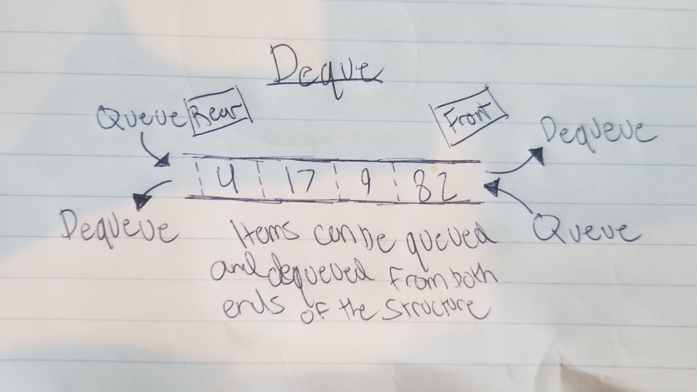

# Deque

A deque is basically a queue that can have values inserted or removed from both the rear and front.

# In Memory

In memory, a deque looks like this:

# Operations

A Deque supports the following operations:

* **Access**: Used to access a specified value in the tree
  * O(n), linear time.

* **Search**: Used to see if there is a specified value in the deque.
  * O(n), linear time.

* **Insertion(Rear)**: Used to queue an item to the rear of a deque
  * O(n), linear time. To queue an item to the rear end of a deque, all values in the deque must first be shifted, which is an O(n) operation. Overall, this makes queuing into the rear an O(n) operation.
  
* **Insertion(Front)**: Uses a stack pointer to simply queue an item on the end of the deque
  * O(1), constant time. Thanks to the stack pointer, we can queue items to the front of the deque with a simple O(1) operation.

* **Deletion(Rear)**: Used to dequeue an item from the end of a deque
  * O(n), linear time. In order to complete a delete operation from the rear of a deque, we must first dequeue the value and then copy and shift all of the values in the deque over. This is why this operation is O(n), unlike dequeuing from the front of the deque.

* **Deletion(Front)**: Used to dequeue an item from the front of a deque
  * O(1), constant time. Because of a stack pointer constantly pointing to the front of the deque, this simple operation is only O(1). Items do not need to be shifted like when inserting or dequeuing an item from the rear of a deque.

# Use Cases

A deque is useful when managing a queue that could cause a bottleneck. Implementation of multiple deques instead could allow for the re-insertion of values into a different deque if there happened to be a bottleneck.

A deque is not as good as a list if you were needing constant access to thousands of values.

# Examples

* **creation**:

~~~
d = Deque()
~~~

* **access**:

~~~

~~~

* **search**:

~~~

~~~

* **insert**:

~~~
d.addRear(30)
~~~

~~~
d.addFront(84420)
~~~

* **delete**:

~~~
d.removeRear()
~~~

~~~
d.removeFront()
~~~

[PREV PAGE](queue.md)

(c) 2018 Michael Fagan. All rights reserved.
