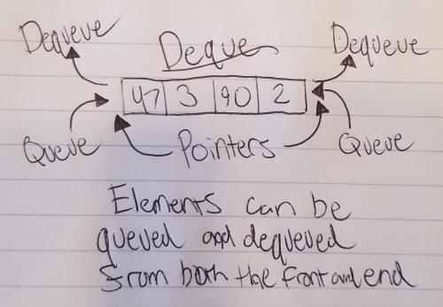

# Deque

A deque is basically a queue that can have values inserted or removed from both the rear and front.

# In Memory

In memory, a deque looks like this:

# Operations

A Deque supports the following operations:

* **Enqueue**: Used to queue an item to either the front or end of a deque
  * O(1), constant time. Because of the pointers pointing to both the front and end of the deque, enqueuing is always a constant operation.
  
* **Dequeue**: Used to dequeue an item from either the front or end of a deque
  * O(1), constant time. Because of the pointers pointing to both the front and the rear of the deque, dequeuing is always a constant operation.
  
# Use Cases

A deque is useful when managing a queue that could cause a bottleneck. Implementation of multiple deques instead could allow for the re-insertion of values into a different deque if there happened to be a bottleneck.

A deque is not as good as a list if you were needing constant access to thousands of values.

# Examples

* **creation**:

~~~
d = Deque()
~~~

* **enqueue**:

~~~
d.addRear(30)
~~~

~~~
d.addFront(84420)
~~~

* **dequeue**:

~~~
d.removeRear()
~~~

~~~
d.removeFront()
~~~

[PREV PAGE](queue.md)

(c) 2018 Michael Fagan. All rights reserved.
