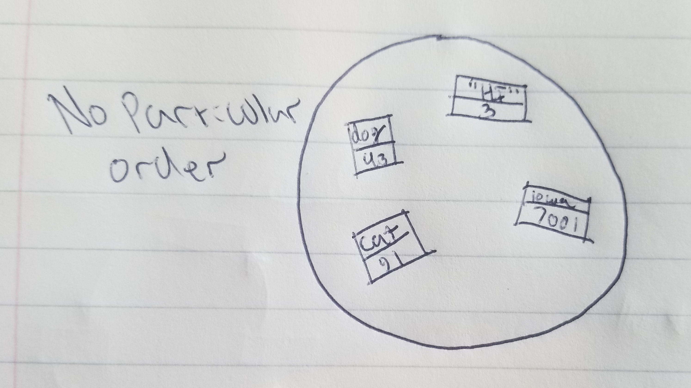

# Set

A dictionary is a structure that is not structured and uses keys to access values, as opposed to most other structures that are structured and allow for indexing.

# In Memory

In memory, a dictionary looks like this:

# Operations

A Dictionary supports the following operations:

* **Get**: Accesses the value of the associated key that was provided.
  * O(1), constant time. This is operation is constant since it simply needs to return the value associated with the key.
  
* **Search**: Used to find whether or not a key and value pair are in the dictionary. If found will return the value associated with the key, other wise will return False.
  * O(1), constant time. Since the search operation must already be given a specified key, we will know whether or not if the key and value pair are in the dictionary. We then simply need to return the value associated with the key.

* **Insertion**: Can be used to add a key and value pair into the dictionary.
  * O(1), constant time. A dictionary isn't supposed to be thought of like a list or any type of ordered list, meaning insertion doesn't require any moving around of other values. The key and value pair are simply inserted into the bag of pairs.

* **Deletion**: Can be used to remove a key and value pair from the dictionary.
  * O(1), constant time. Since the delete operation is provied a key, the only thing that needs to be done is remove the pair.

# Use Cases

A dictionary is useful for finding specified values, since the search operation is O(1) and most other structures are O(n).

A dictionary is not as good as a list or any other structured data structure when needing to iterate over, since a dictionary simply has no structure and cannot be iterated over.
# Examples

* **creation**:

~~~
myDictionary = {'Billy':5411231234,'Dog':'Bark'}
~~~

* **get**:

~~~
myDictionary.get(Billy)
~~~

* **search**:

~~~
myDictionary[Dog]
~~~

* **insert**:

~~~
myDictionary['Cool'] = 'Dogs'
~~~

* **delete**:

~~~
del myDictionary[Cool]
~~~
