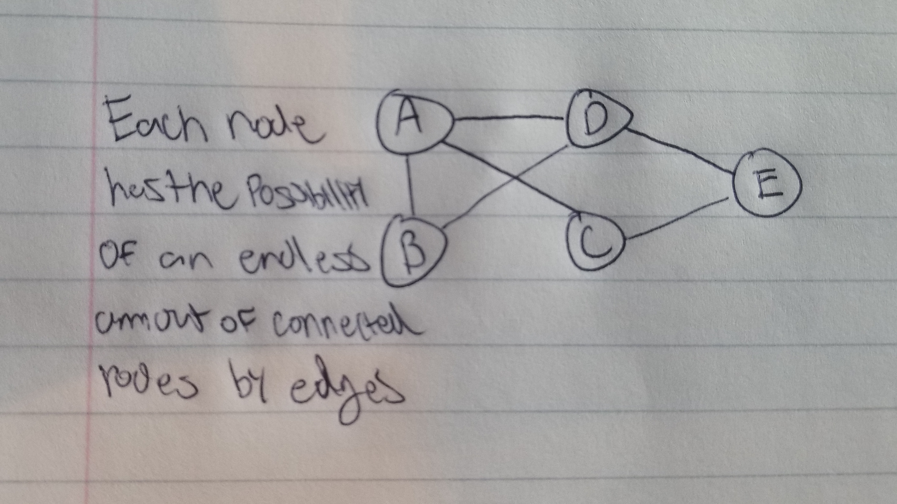

# Graph

A graph is similar to a tree in that it has nodes and edges. Although, a graph does have edges with weights and can have multiple edges connecting to other vertices.

# In Memory

In memory, a graph looks like this:

# Operations

A Graph supports the following operations:

* **Insertion(Vertex)**:
  * O(1), constant time.

* **Insertion(Edge)**:
  * O(1), constant time.

* **Deletion(Vertex)**:
  * O(|E|).
  
* **Deletion(Edge)**:
  * O(|V|).

# Use Cases

A graph is useful when you need 

A graph would not be as good as a 

# Examples

* **creation**:

~~~
myGraph = Graph()
~~~

* **insert**:

~~~

~~~

* **delete**:

~~~

~~~

~~~

~~~

[PREV PAGE](hashtable.md)

[NEXT PAGE](deque.md)

(c) 2018 Michael Fagan. All rights reserved.
