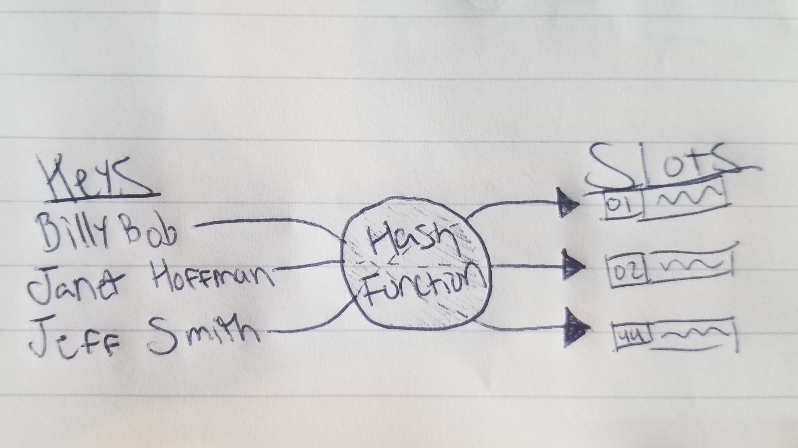

# Hash Table

A hash table is a structure that uses a hash function to convert a key into a value.

# In Memory

In memory, a hash table looks like this:

Description

# Operations

A Hash Table supports the following operations:

* **Search**: 
  * O(n), linear time.

* **Insertion**: 
  * O(n), linear time.

* **Deletion**: 
  * O(n), linear time.

# Use Cases

A hash table is useful when

A hash table is as good as

# Examples

* **creation**:

~~~
HT = HashTable()
~~~

* **access**:

~~~

~~~

* **search**:

~~~

~~~

* **insert**:

~~~

~~~

* **delete**:

~~~

~~~

