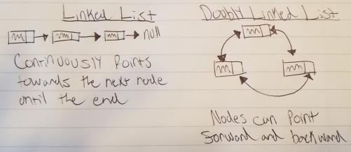

# Linked List

**Linked List**: A linked list is composed of nodes that when continuously pointed towards the next node creates a list, which is therefore considered a linked list.

# In Memory

In memory, a linked list looks like this:

Description

# Operations

A Linked List supports the following operations:

* **Access**:
  * O(n), linear time.

* **Search**: Searches existing nodes for a provided value.
  * O(n), linear time.

* **Insertion**: Inserts a new node with a provided value.
  * O(1), constant time. Because of the way nodes store values and the addresses that they are pointing to next, insertion is fairly simple. A new node must simply be created, then point to a new node or null, and then have a previous node point to the new node. This assignment doesn't require any shifting or copying, therefore it is simply O(1).

* **Deletion**: Deletes a node with a provided value.
  * O(1), constant time. Much like insertion, all that must be done is change the addresses to which each node in the list points. The address being pointed to by the node being deleted must simply be reassigned to the previous node that originally was pointing to the node being deleted.

# Use Cases

A linked list is useful when simply inserting or removing nodes from the structure since these two operations are O(1).

A linked list is not as good as a BST or AVL Tree would be when having to access, search, insert and delete.

# Examples

* **creation**:

~~~
list = UnorderedList()
~~~

* **access**:

~~~

~~~

* **search**:

~~~
list.search(item)
~~~

* **insert**:

~~~
list.add(item)
~~~

* **delete**:

~~~
list.remove(item)
~~~
