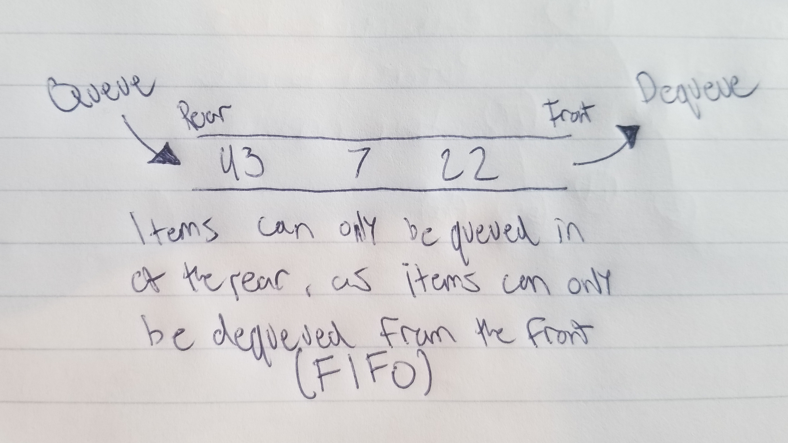

# Queue

A queue is a two sided structure that allows for quick enqueuing in the rear and quick dequeuing from the front.

# In Memory

In memory, a queue looks like this:

# Operations

A Queue supports the following operations:

* **Enqueue**: Queues an item on the rear end of the queue.
  * O(1), constant time.

* **Dequeue**: Dequeues an item on the front end of the queue.
  * O(1), constant time.

# Use Cases

A queue is useful when you need to regulate information being distributed. Queueing and dequeuing items allows for a quick insertion and deletion as well as O(1).

A queue would not be as good as a list, since accessing values is not as efficient.

# Examples

* **creation**:

~~~
myQ = Queue()
~~~

* **enqueue**:

~~~
myQ.enqueue(80000)
~~~

* **dequeue**:

~~~
myQ.dequeue
~~~

[PREV PAGE](binaryheap.md)

[NEXT PAGE](deque.md)

(c) 2018 Michael Fagan. All rights reserved.
