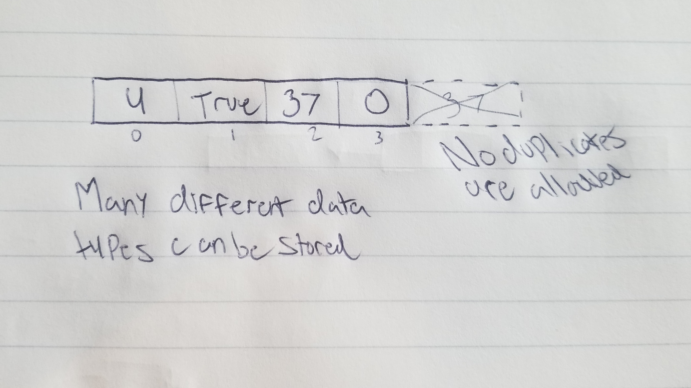

# Set

A set is a structure that allows for many data types to be stored, in no particular order.

# In Memory

Conceptually, a set looks like this:

# Operations

A Set supports the following operations:

* **Access**: Allows for access of a specified item or value.
  * O(1), constant time. To access a value in a set, we can use our hash function to find the associated value. Providing a key will return us the associated value, which doesn't require us to search through the entire set. Therefore, this operation is constant.

* **Search**: Allows us to search through the set and see if the provided value is present.
  * O(1), constant time. Searching through a set is constant time because we provide a key, which is then associated with a value. We can use this to return a boolean. This operation, much like accessing a value in a set doesn't require traversing the entire structure; only a single key and associated value. Therefore, this operation is constant.

* **Insertion**: Allows us to add an item to the set, as long as the item being inserted is not a duplicate.
  * O(1), constant time. Adding an item to the set requires only a provided key and an assigned value to that key. The key is then passed through the hash function, which then assigns the value to that key. This allows for a constant operation.

* **Deletion**: Simply removes an item from the set.
  * O(1), constant time. Deletion only requires a key to find the associated value, which then must only be removed from the set. No shifting or traversing must be done, therefore this operation is going to be constant.

# Use Cases

A set is useful when you would like to combine two structures and get rid of the duplicate values when joining the two structures.

A set isn't useful when trying to to manage duplicate numerical values, since the duplicates won't be stored.

# Examples

* **creation**:

~~~
mySet = {3,"dog",340000}
~~~

* **access**:

~~~
print(mySet[2])
~~~

* **search**:

~~~
5 in mySet
~~~

* **insert**:

~~~
mySet.add("froggg")
~~~

* **delete**:

~~~
mySet.remove(5)
~~~

[PREV PAGE](linkedlist.md)

[NEXT PAGE](tuple.md)

(c) 2018 Michael Fagan. All rights reserved.
