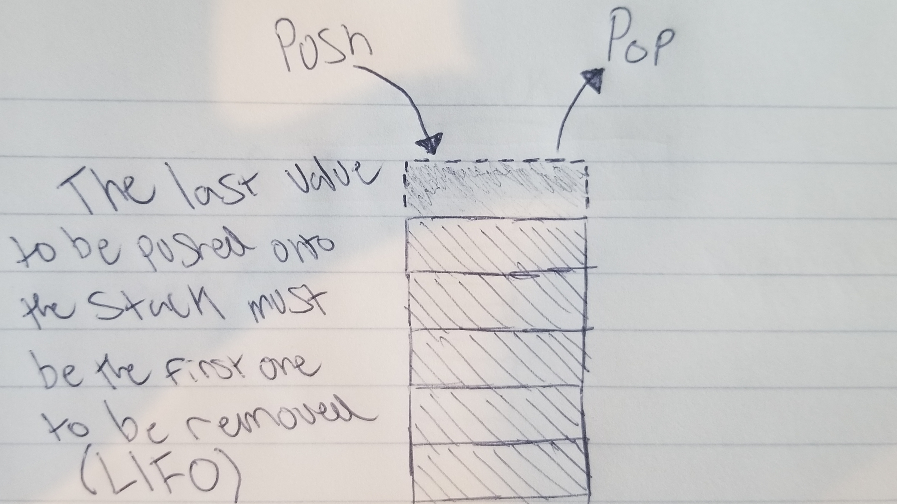

# Stack

A stack is a data structure that is not ordered but only has one end that can be modified. Items can neither be added to the bottom or middle of the structure. The way this structure behaves is called LIFO(Last In, First Out).

# In Memory

In memory, a stack looks like this:

\[description of diagram\]

# Operations

A stack supports the following operations:

* **push**: Places an item at the top of the stack.
  * O(1), constant time. Because of the stack pointer keeping track of the top of the stack, all that needs to be done is increment and then add an item to the top. This is why this operation is simply O(1).

* **pop**: Returns the item at the top of the stack.
  * O(1), constant time. This operation is constant thanks to the stack pointer being based at the top of the stack. The only work the pop operation must do is simply return the value stored at the stack pointer. We don't need to peek inside to return it, which is why it isn't O(n).

* **peek**: Returns the item at the top of the stack without removing it or cahanging the stack pointer.
  * O(n), linear time. Regardless of whether the stack pointer knows to point to the top of the stack in order to return the top item, this operation is still going to be O(n). This is because we must still access the address in which the information is stored, instead of simply knowing what to return or where to store an item.

# Use Cases

A stack is useful when needing to backtrack or see history in a program. Each operation done in a program can be simply pushed onto the stack and then be accessed by popping it off of the stack.

It is not as good as storing hundreds of values that might need to be accessed at any time. We can only access the top value, which means if our desired value was at the bottom we would have to pop everything else off to access just a single value.

# Example

* **creation**:

~~~
Stack()
~~~

* **push**:

~~~
push(item)
~~~

* **pop**:

~~~
pop()
~~~

* **peek**:

~~~
peek()
~~~

(c) 2018 Michael Fagan. All rights reserved.
