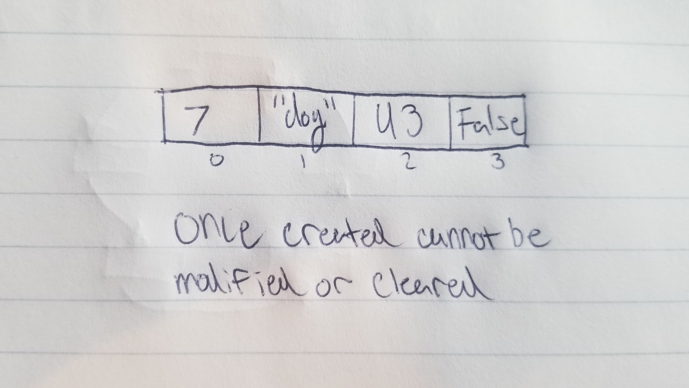

# Tuple

A Tuple is a structure that is similar to a list, but is not immutable.

# In Memory

In memory, a Tuple looks like this:

# Operations

A Tuple supports the following operations:

* **Access**: Allows for access of all values by a provided index.
  * O(1), constant time. Because the same amount of space is already allocated with the creation of the tuple, you can increment through a tuple with constant time to access a provided index.

* **Search**: Allows us to search through the tuple and see if the provided value is present.
  * O(n), linear time. In order to find a specified value inside the tuple, we must traverse through the tuple. The worst case scenario could be that the value is the last in the tuple, therefore this operation is linear.

# Use Cases

A tuple is useful when multiple operations might need to access a piece of data at the same time, but we don't want any of the data to be modified.

A tuple is not as good as any mutable structure when needing to modify values on the fly.

# Examples

~~~
myTuple = (2,"cat",34)
print(myTuple[0])
34 in myTuple
~~~

[PREV PAGE](set.md)

[NEXT PAGE](dictionary.md)

(c) 2018 Michael Fagan. All rights reserved.
